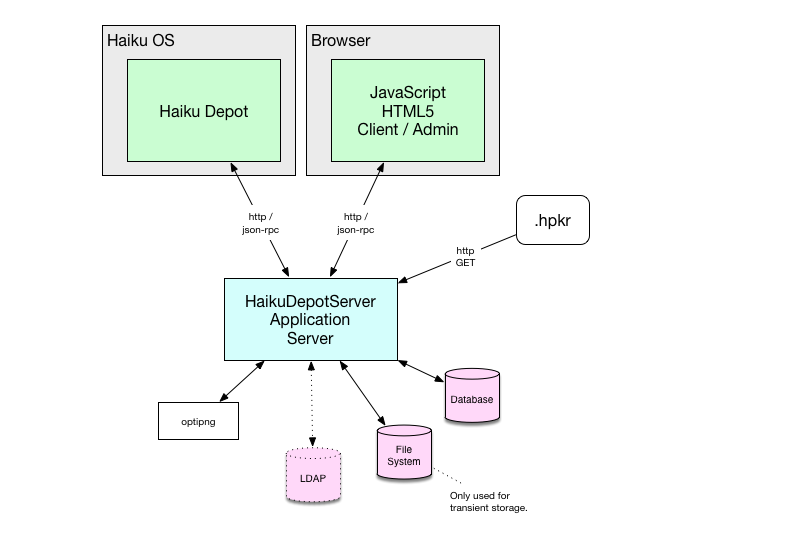
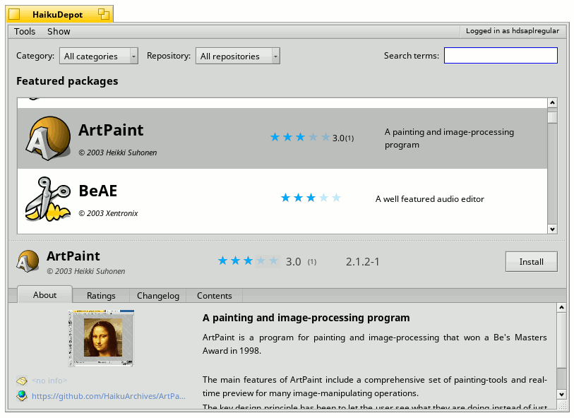
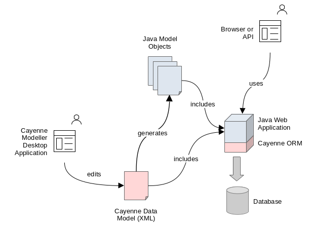

# Web / Application Server Architecture

This section covers a broad architectural overview of the system.

## Elements

The following diagram provides an overview of the elements of the system's architecture and how they inter-relate;

### HDS

The HDS component provides the bulk of the functionality of the system. It is built and packaged to an executable java `.jar` file and is primarily using Java and the [SpringBoot](https://spring.io/projects/spring-boot) framework. The software is packaged as a container image and deployed as a Kubernetes deployment.

The HDS application server communicates (see [api](/api.md)) with its clients using the HTTP protocol.  The communications are *typically* RPC style in nature, but also straight GET, POST and other requests are employed where appropriate.

The HDS application server also provides a web-front end contains a JavaScript/HTML client that utilizes the same API as is employed by the "Haiku Depot" desktop application running on the Haiku operating system.

### HDS-GS

The HDS-GS component provides graphics operations for the system including;

- rendering of Haiku-custom HVIF files as `.png`; typically icons
- scaling of `.png` images
- optimization of `.png` images

The HDS-GS a thin custom Java / [SpringBoot](https://spring.io/projects/spring-boot) application that delegates to a number of off-the-shelf native binaries such as;

- `convert` from [ImageMagick](https://imagemagick.org/)
- `optipng`
- [`oxipng`](https://github.com/shssoichiro/oxipng)
- [`pngquant`](https://pngquant.org/)

Also packaged into HDS-GS container image is `hvif2png` which is a binary from the Haiku source code. This tool renders Haiku's own native icon format HVIF into `.png` format for use in the web user interface of the HaikuDepotServer system.

The HDS-GS application server is separated from the HDS application server because;

- different scaling behaviours
- security; a vulnerability in an off-the-shelf native graphics tool is less likely to pose a threat to the core system
- the graphics binaries do not need to be packaged into the HDS image meaning that it can be a smaller container image.

HDS-GS is stateless and is communicated with using POST HTTP requests.

### HaikuDepot

The HaikuDepot desktop application is an important client of the HDS application server. The source for this application is located in the Haiku source code.

### HPKR and HPKG data

The HDS application server will, when prompted or on a poll, import Haiku package repository data from configured Haiku package repositories. This fetched data is in the HPKR and HPKG formats. To obtain this data, HDS uses HTTP GET requests to obtain the `.hpkr` files from each repository.

### Storage

The application server stores all of its core data in a database.  It also uses local storage for temporary data storage.

### Logging for HDS and HDS-GS

The application server uses [SLF4J](http://www.slf4j.org/) to provide for logging. Other common logging frameworks are re-plumbed into SLF4J in order to centralize logging management.

## HDS Specifics

The following sections are specific to the HDS application server.

### Object-Relational / Data

Diagram of Apache Cayenne elements;

The object-relational mapping (ORM) technology used in the project is [Apache Cayenne](http://cayenne.apache.org/). Apache Cayenne has a different transaction-handling approach to other common java ORM solutions. It maintains an in-memory model of the changes made in a context and then flushes those changes to the database when the context is committed.  For this reason, there is no notion of a "database transaction per request".  The entities are described in a model file (for which there is a desktop application for editing.) `cayenne-haikudepotserver.xml` and the java objects that represent those entities in the running application are in the java package `org.haiku.haikudepotserver.dataobjects`.  The application server has no formal DAO layer; queries are simply made from the ORM context.  Static methods on concrete entity objects provide easy access to common queries and various services such as `PkgIconService` and `PasswordResetService` provide higher level functionality in various logical areas of the application.

Using the Cayenne listeners such as `PostAddMutableCreateAndModifyTimestampListener` and `UserRatingDerivationTriggerListener` the system is able to use changes to entities as a trigger to perform tasks such as update the create and modify timestamp attributes on entities.

#### Cayenne Query Caches

Caching data uses the Cayenne query caches.  These are defined on the `HaikuDepot#CacheGroup` enum and are used in various Cayenne queries.  An example would be on `PkgIconImage#findForPkg(..)`.  The caches are cleared by listening for any change on the entity by using a listener.  These are configured as Spring beans in the `persistence.xml` file.  This is fairly liberal cache eviction, but will work well for the time being.

#### Migration

On first-use the application server will populate the database schema-objects (tables, sequences and so on) itself.  It does this with a library called [Flyway](http://flywaydb.org/). Later, as new versions of the application server are deployed, the application server will detect that a database upgrade is required and run the necessary migration scripts.  The migration scripts can be found in the source-code at `/haikudepotserver-webapp/src/main/resources/db/...`.

## Multi-Page Web Interface

The multi-page web interface is designed to provide a simplistic web experience with reduced features for lower-end browsers that have limited JavaScript support.  This interface is public-facing only in that it is not possible to meaningfully authenticate with the system when using the multi-page web interface.  This interface is constructed with the Spring MVC framework and Thymeleaf templating.  Pages are rendered server-side and delivered to the web browser.

## Single-Page Web Interface

The single-page interface is the primary web-based user interface for the system.  It provides functionality directed at public (unauthenticated), authenticated, administrative and root users. This interface is built using HTML and JavaScript in a Single Page Application (SPA) architecture.  The SPA interface uses the exact *same* APIs as the desktop Haiku Depot application and so is a true client of the application server.

The whole system is treated as &quot;full stack&quot; and so the application server as well as the single-page interface are part of the same project and the same build-product.  The application server serves the resources required for the single-page interface.

### AngularJS / Single Page

The interface is driven by the [AngularJS](https://angularjs.org/) JavaScript framework.  This framework provides for browser-side page rendering, navigational flow. You can find the AngularJS-centric resources at `/haikudepotserver-webapp/src/main/webapp/js/app/...`.  AngularJS is no longer supported.

### User State

The user state including who is authenticated is stored in an AngularJS service within the browser's local storage.  The user state is not stored server-side in a session and the user's browser does not maintain reference to a cookie.  The user's authentication is instead communicated to the server based on a signed token.  The token has an expiry and so needs to be periodically refreshed.  Because of this, the user state logic in the client will communicate with the server to refresh the user's token from time to time.

### Localization

Details about localization can be found under [application localization](application-localization.md).

### Images

Where possible, images used in the user interface are provided as SVG so that they can be rendered in a resolution-independent manner.

### Delivery

The single-page interface is delivered by a single Thymeleaf page. The web resources such as the JavaScript files and CSS files are assembled in a separate module `haikudepotserver-spa1` which concatenates and compresses the resources and makes them available to the webapp.

## Security

See [the security section](security.md) for an overview of the authentication and authorization from the perspective of a user. The application uses Spring Security and is configured in `SecurityConfig.java`.

### Authorization

API exists for answering queries relating to authorization.  The AuthorizationApi endpoint provides these services.  In this way clients are able to check for permissions to undertake operations on some resource.  The types of resources are;

- Package
- User
- Repository
- User Rating

These are typically referenced by their natural or artificial identifier.  In the case of a package this would be the name of the package (eg; `git`, `bemail`). In the case of a user rating, this would be the user rating's code (eg; `FA91FA34-D0BE-47A2-8114-CE33CACAE533`).

Permissions are defined on the `Permission` enum.  Examples of permissions include;

- `REPOSITORY_EDIT`
- `USER_CHANGEPASSWORD`
- `PKG_EDITPROMINENCE`

The client is expected to hide or show options or data in accordance with a user's security situation, but the application server will also enforce authorization server-side as the client uses API in the system.

Permissions related to packages can be configured in the database on the PermissionUserPkg entity. Users can be assigned either a specific permission across all packages or for a specific package. This way if a user is an owner of a package then they can be assigned special permissions on that package.

## Email

Email outbound from the application server includes;

- Forgotten Password

mail is delivered with the Spring Framework's email support.  The email templates are produced with the [Freemarker](http://freemarker.org/) library.  The templates for the emails are located at `/haikudepotserver-webapp/src/main/resources/mail/...`.

## Jobs

The application must perform various background jobs from time to time that are impractical to have occur as part of an HTTP request or that are initiated from a process other than an HTTP request.  These are known as jobs.  Examples of situations where jobs are required include;

- Importing repository data
- Generating a report of localization coverage
- Importing a tar archive of package icons

Class-diagram related to the jobs infrastructure;

The figure above shows a number of the key classes that form the functionality of the jobs system. For each new job, there needs to be a concrete subclass of JobRunner and a corresponding concrete subclass of JobSpecification. Together these provide a means of defining the parameters of the job and a means of running the job.

In general, manipulating, enqueueing and querying jobs is done through the JobService. The service will typically return results of type JobSnapshot to indicate the status of the running job.  The JobSnapshot instance is immutable. A job is identified by a GUID.  An example of a GUID would be `98F4B8C0-2F42-4233-813D-AB90C60F6717`.

As a job progresses, it moves between a number of states;

- `INDETERMINATE`
- `QUEUED`
- `STARTED`
- `FINISHED`, `FAILED`, `CANCELLED`

The `JobSnapshot` will convey both the state and also the time at which a state transition
occurred.

### Job Data

Some jobs require data inputs and outputs.  An example might be a package category import job. Such a job requires that a CSV file of changes is supplied and the job will export a new CSV file with a list of the changes made.  These input and output files are managed by the JobService and can be referred to by a GUID.

The JobSpecification object will maintain a GUID for the supplied input data.  The supplied input data can be populated into the JobService ahead of creating the JobSpecification.  Various methods are exposed on the JobService to support the manipulation of job data.

The JobService keeps track of generated output data and its association with a given job.

### Ownership

The JobSpecification can store a User nickname in order to identify the owner of a job.

### Time to Live

As the application server may be running a number of jobs over time, these would pile-up in the memory of the application server and data related to these reports would pile-up in storage.  To avoid this, jobs have a time-to-live which is specified as an attribute of the `JobSpecification`.

### Interfacing with Jobs

API specific to each `JobRunner` / `JobSpecification` is provided in order to allow a job to be started from the web interface. The `JobController` is able to allow the client to upload supplied input data and for the client to download generated output data via HTTP POST and GET requests respectively.

## Feeds

The application server is able to produce Atom or RSS feeds that can provide updates relating to packages.  The feeds are in the context of one or many packages.  These are produced by the `FeedController` class which uses the [Rome](http://rometools.github.io/rome/) library to render the feed to XML. See the `FeedService` for further details about this process.

## Captcha

For some operations such as creating a user or changing password, it is necessary to verify that the user is a human operator and not a machine.  To achieve this, a pictographic representation of a puzzle is shown to the user.  This has a simple textual response.  A mechanism for this is in the `org.haikudepotserver.captcha` package.

A typical use pattern will involve the client first creating a captcha.  This creation process will yield a token for the captcha as well as an image to display to the human operator.  When the second API is used that requires the captcha response, the client's call will contain both the textual response from the human operator as well as the token to identify the captcha.