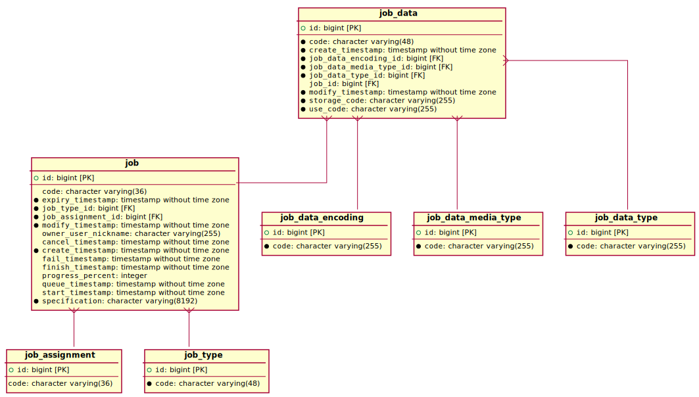

# Jobs

## Background

The job system is the means by which HDS is able to run asynchronous tasks such as;

- scheduled maintenance
- download and integration of data from a Haiku package repository
- reports

## Schema

The jobs are stored in the database in the following schema;

`job` is the master table for the job and `job_state` contains the state of the execution of the job.

The table `job_supplied_data` captures data that the user supplied for the job to use. The table `job_generated_data` captures data that the job produced. In both cases these tables use the [data store](./storage.md) system to actually persist the data.

Each entry in the `job` table has a `job_specification` table entry; this contains a JSON-serialized copy of the object that specified the job to run.

## Hibernate

Unlike most of the rest of the system, the job system uses the [Hibernate](https://hibernate.org/orm/) ORM and JPA to interact with the job database tables. See the class `JpaJobService` for implementation.

## Architecture

The job system is distributed such that multiple instances of HDS are able to operate at once and any instance is able to pick-up a job and run it. The system uses Postgres `NOTIFY` / `LISTEN` to signal to all instances that new jobs are available to pickup.

To avoid two or more instances of HDS picking up the same job, the system uses Postgres "skip locks" ensuring that only one HDS instance will process a job.

See the class `DbDistributedJobServiceImpl` for the implementation of this system.

## Garbage Collection

The HDS system will be frequently running jobs and their details will pile-up in the database. To expunge expired jobs, a periodic task runs as part of the maintenance system. See the class `JobGarbageCollectionJobRunner` for details.