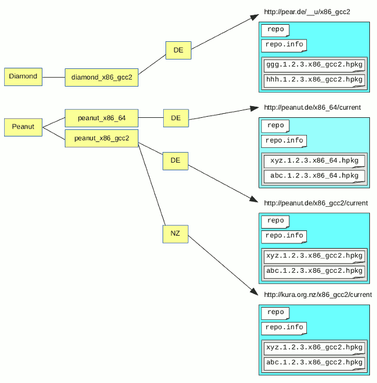

# Repositories

## On-Net / On-Disk Haiku Package Repositories

The term "On-Net" or "On-Disk" are used here interchangeably to represent an operating-system level repository that consists of a number of files that might be accessed by some physical storage mechanism such as a USB stick or might be accessed over a network interface using the HTTP protocol for example.

Repositories are a collection of packages together with some meta-data or index about the packages.  A Haiku-OS concept of a repository is a set of URL-accessible resources.  A base URL might be something like;

```
http://packages.haiku-os.org/haikuports/master/repo/x86_gcc2/current
```

At this location, a number of resources should exist that have well-known names so that they can be easily found.  The resources in a repository are generally targeting a specific architecture such as `x86_gcc2`, but there may also be resources for `any` architecture as well.

### `repo`

This file contains the binary HPKR data that catalogs the various packages in the repository. Haiku Depot Server will feed-in this data in order to inform itself about the current state of the packages available in the repository.

### `repo.info`

This file contains some brief information about the repository itself rather than the packages in the repository.  This file is plain text.  Here is an example of the files' contents;

```
name HaikuPorts
vendor "Haiku Project"
summary "The HaikuPorts repository (for Haiku R1 BETA3)"
priority 1
identifier tag:haikuports.org,2013:repositories/haikuports/r1beta3/x86_gcc2
architecture x86_gcc2
```

The `identifier` parameter is important because it acts as a unique identifier for the repository.  It is important to remember that the 'identifier' parameter here is consistent across mirrors of the same repository.

### packages

This directory contains the packages themselves.  The packages are in HPKR binary format.  The package files have standard names.  Some examples;

- `zlib-1.2.8-4-x86_gcc2.hpkg`
- `gnupg-1.4.16-1-x86_64.hpkg`
- `beam-1.2-2-x86_gcc2.hpkg`

## Haiku Depot Server Repositories

Haiku Depot Server's (HDS) concept of a `Repository` is, in nomenclature, slightly mis-aligned with the On-Net concept.  An HDS `Repository` represents the collection of On-Net `Repositories` that are conceptually serving the same or similar packages for different architectures.  A `RepositorySource` is a placeholder for the different architectures.  A `RepositorySource` may then have one or more `RepositorySourceMirrors` in order to store a URL to the repository data for a given geo-location identified by a country code; for example...

- `NZ` - New Zealand
- `DE` - Germany
- `CZ` - Czech Republic

The following diagram illustrates the relationship between the Haiku Depot Server Repositories and the On-Net repositories of the operating system.  The yellow elements are the HDS elements and the blue elements are the on-net elements.



In this artificial example, an HDS Repository "Peanut" exists. Consider for example that a given system is `x86_gcc2` architecture and is located in New Zealand then it would be possible to follow the path through the `Repository` to the `RepositorySource` to the `RepositorySourceMirror` in order to obtain the Base URL to be used in order to access the On-Net files of the repository.

## Refreshing Repositories

HDS has its own view of an 'on-net' repository and it is possible that the 'on-net' repository has been updated and so is newer than the HDS view of the same data.  This section discusses how the HDS data can be updated so that its data is synchronized with the remote 'on-net' data.

Ultimately what happens is that through some mechanism, HDS is prompted to fetch the remote data and to import it.  A periodic process will run that will cause HDS to run from time to time and to import the remote data for each `RepositorySource`.  In a specific example, for "haikuports" repository for `x86_64`, each day, HDS will pull down the HPKR data and will import it.

Often the 'on-net' remote repository data is updated.  This might happen because a package has been updated and the remote HPKR data is re-built with the new package data included in it.  At this moment, after the build is complete, it would be ideal for HDS to be prompted to poll the repository in order to pull down the HPKR data and update its own records.  HDS [provides a simple API](api.md#trigger-import-repository-data) for this and the administrators of repositories are invited to use this API in order to cause HDS to update its own records in a timely fashion.

