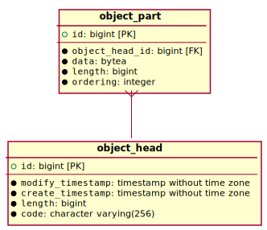

# Storage

Binary data from the HDS system such as the input and output for the jobs system are stored in the primary database. A database is most likely not the most optimal storage media of this type, but has been used in this way anyway because;

- HDS does not have very much data storage and is not a high-volume system
- it is easy to share the database between instances of HDS
- the database is already in place and so represent no additional overhead or complexity
- the interfaces are already in place so that a different storage solution can be swapped in later if required

## Schema

The schema is very simple and consists of two tables;

- `datastore.object_head`
- `datastore.object_part`

The head is identified by a `code` and the head may have one or more parts each of which contains a blob.

The system allows for easy random access to the storage as well as streaming.

## Raw SQL

The system uses raw SQL to interact with the storage tables in the database. This allows for more finely-tuned queries.

## Code

See the source in the `haikudepotserver-core` module under the `org.haiku.haikudepotserver.storage` package.

## Garbage Collection

A periodic task will run from time to time that clears out old data so that it does not pile up in the database. See the class `DataStorageGarbageCollectionJobRunner` for details on how this works. It is executed as part of the scheduled maintenance tasks.